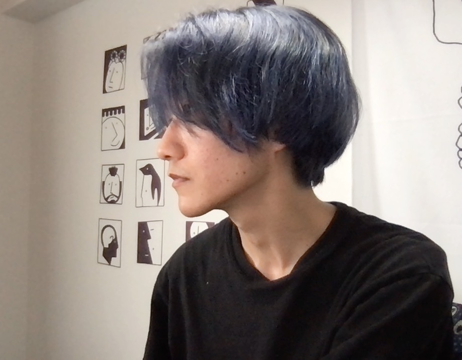

<h2>🧑 안녕하세요 👋🏼 </h2> 

<b>유유 (Eu, Yuu)</b>입니다.

저는 도전하고 배우며 성장하는 것을 좋아하는 영원한 <wbr>학생,<wbr> 
끄적끄적 취미로 그림을 그리는 <wbr>그림쟁이, <wbr>카페에서 공부하기 좋아하는 <wbr>카공족, 
<wbr>커피=에너지인 커피 <wbr>사피엔스, 가끔 귀차니즘이 발동하여 <wbr>뒹굴뒹굴 거리기도 하는
<wbr>그런 주니어 <wbr>프론트엔드 개발자입니다.

---
 

    

    <h3>⚙️ Tech Stack ⚙️</h3> 
    

    
    
    

     
    

    
    
    
    

     
    

    
    
    
    

     
    

    
    
    

     
    

  <h3>🐱 Reach Me 🐱</h3>
  

  
  
  
  
  

