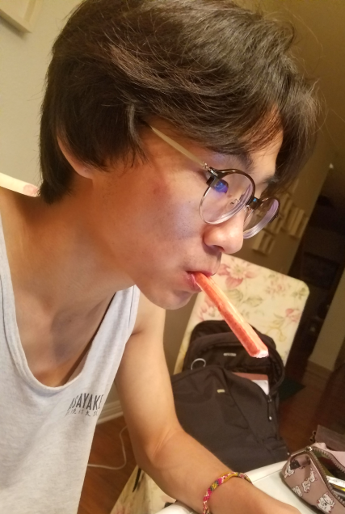

<h3>Education</h3>
<ul style="padding-left: 35px; font-size: 13px">
University of California, San Diego  (2019) 
 B.S. Cognitive Science w/ Spec. in HCI
</ul>

<h3>Skills</h3>
<ul style="padding-left: 35px; font-size: 13px">
main language: C, C++  
conversational: Java, HTML/CSS  
tourist: Python, Ruby, C#
 
 
os: Linux, Windows
</ul>

<h3>Hobbies</h3>
<ul style="padding-left: 35px; font-size: 13px">
Taiko, Japanese Drumming (2018 ~ present)  
- Asayake Taiko - San Diego, CA  
- LA Taiko Institute - Torrance, CA
</ul>

 

<ul class="center">

"Tell me and I forget. Teach me and I remember. Involve me and I learn"   - Benjamin Franklin

</ul>

